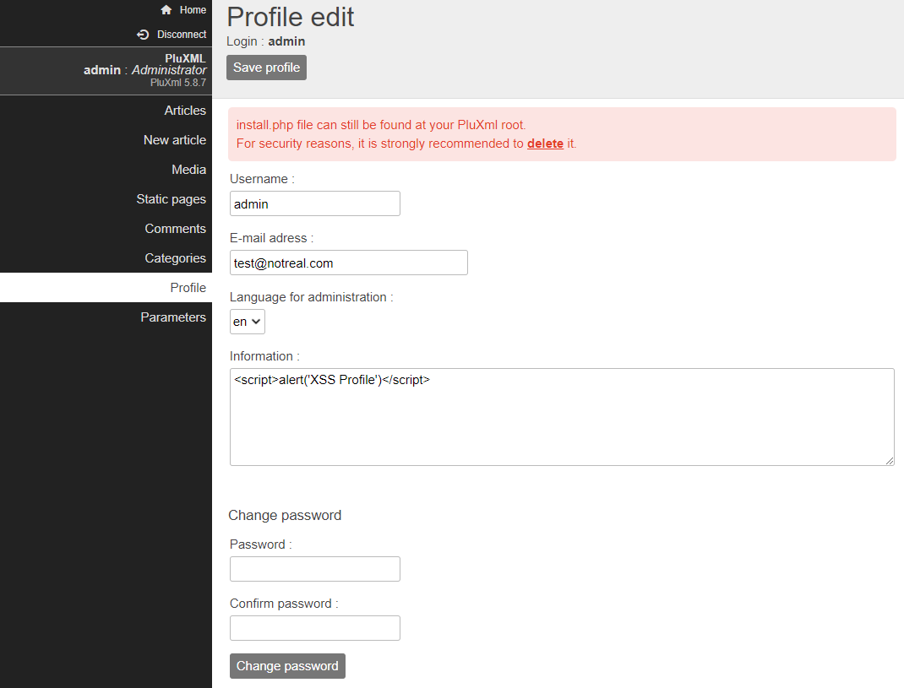
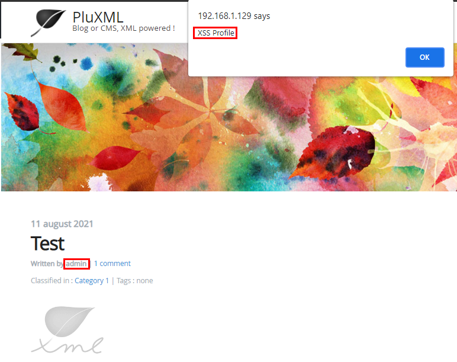

# CVE-2021-38603

A stored cross site scripting vulnerability is present on the Profile edit page in the **Information:** field for each user.

## http://\<hostname/server ip\>/core/admin/profil.php

### Vulnerable Fields:

- Information:

Once inserted, XSS can be triggered by visiting any page/article created by that particular user.

